# Panduan Admin Panel — LAZ Darul Hikam

Panduan ini menjelaskan **setiap menu di admin panel**, data/field yang bisa diisi, aksi yang tersedia, dan **bagian mana di website publik** ([web-cf-darulhikam.vercel.app](https://web-cf-darulhikam.vercel.app)) yang dikendalikan oleh menu tersebut — lengkap dengan screenshot pembanding.

Admin panel punya **2 modul**, dipilih lewat ikon di rail paling kiri sidebar:

| Modul | Ikon rail | Isinya |
|---|---|---|
| **Crowdfunding** | 🏠 (LayoutDashboard) | Kampanye, transaksi donasi, donatur, afiliasi, payment, dsb. |
| **Website CMS** | 🌐 (Globe) | Konten halaman publik: artikel, testimoni, mitra, laporan, dsb. |

> Screenshot di panduan ini diambil langsung dari situs publik yang sedang live, untuk menunjukkan **efek nyata** dari setiap menu.

---

# Bagian 1 — Modul Website (CMS)

Modul ini murni mengatur **konten** situs publik: teks, gambar, dan urutan tampil. Tidak berhubungan dengan uang/transaksi.

## 1. Artikel — `/web-articles`

**Mengatur:** Bagian **"Kabar Kebaikan"** (menu Kabar Kebaikan) dan blok **"Berita & Laporan Terbaru"** di beranda.

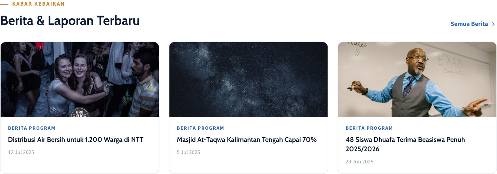

- **Field:** Judul (`title`, wajib), Judul panjang (opsional, dipakai di halaman detail), Ringkasan/`excerpt` (wajib), Isi artikel — rich text editor (wajib), Kategori (wajib, dropdown dari menu *Kategori Artikel*), Status (`draft` / `published` / `archived`), Gambar sampul, Tampilkan di Beranda (featured), SEO title/description, canonical URL, robots directive.
- **Tidak bisa diisi manual:** slug (dibuat otomatis dari judul) dan penulis (otomatis dari akun admin yang login).
- **Aksi:** Tulis Artikel (buat baru), Edit, Hapus.
- **Catatan:** Hapus artikel = **soft delete** (artikel diarsipkan, datanya tidak hilang dari database, hanya hilang dari daftar publik). Kategori wajib dipilih — buat dulu kategorinya di menu berikutnya kalau belum ada. Kolom pencarian di daftar mencari lewat judul/ringkasan.

## 2. Kategori Artikel — `/web-article-categories`

**Mengatur:** Filter kategori yang muncul di halaman **Kabar Kebaikan** (tombol "Semua", "Berita Program", "Kisah Inspiratif", dst).

- **Field:** Nama (wajib), Slug (otomatis dari nama, tapi bisa diedit manual), Status Aktif/Tidak Aktif.
- **Aksi:** Tambah, Edit, Hapus — semuanya dilakukan langsung di baris tabel (inline), tanpa popup.
- **Catatan:** **Kategori yang masih dipakai artikel tidak bisa dihapus** — pindahkan/hapus dulu artikelnya. Kategori selalu tampil urut abjad (tidak ada pengaturan urutan manual).

## 3. Testimoni — `/web-testimonials`

**Mengatur:** Blok **"Suara Mereka yang Merasakan Dampaknya"** di beranda.

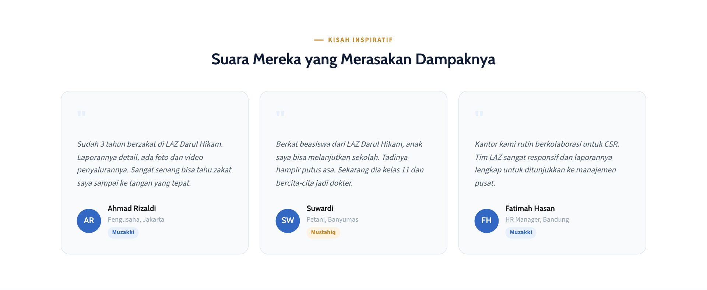

- **Field:** Nama (wajib), Peran/lokasi — misal "Pengusaha, Jakarta" (wajib), Tipe — Donatur (muzakki) / Penerima Manfaat (mustahiq), Kutipan/quote (wajib), Foto (opsional — kalau kosong otomatis pakai inisial nama), Urutan tampil (angka), Status Aktif.
- **Aksi:** Tambah, Edit, Hapus (langsung terhapus permanen, ada konfirmasi).
- **Catatan:** Urutan tampil diisi **angka manual** (bukan drag-and-drop) — makin kecil angkanya, makin duluan muncul.

## 4. Mitra — `/web-partners`

**Mengatur:** Blok **"Dipercaya Lembaga Terkemuka"** di beranda (logo-logo partner).

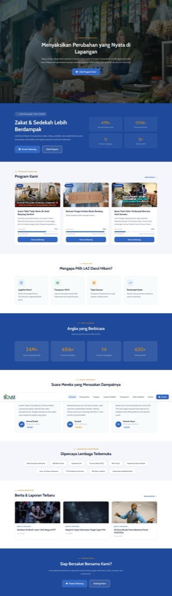

- **Field:** Nama (wajib), Jenis mitra (Korporat/Pemerintah/NGO/Akademik/Media/Lainnya), Website (opsional), Logo (disarankan PNG/SVG transparan), Urutan tampil, Status Aktif.
- **Aksi:** Tambah, Edit, Hapus.
- **Catatan:** sama seperti Testimoni, urutan tampil pakai input angka manual.

## 5. Laporan Keuangan — `/web-reports`

**Mengatur:** Bagian **"Unduh Laporan Audit"** di halaman **Transparansi**.

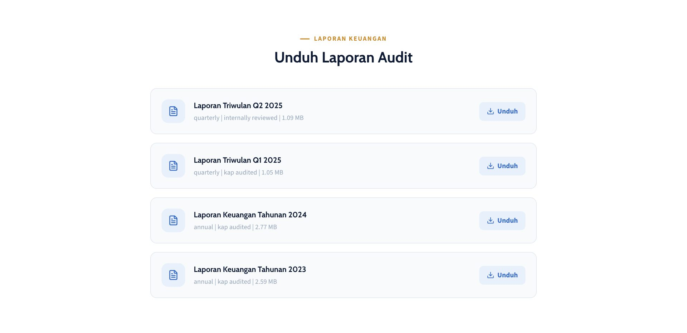

- **Field:** Judul (wajib), Jenis laporan (Tahunan/Triwulan/Bulanan/Audit Khusus), Label periode — misal "Q2 2025" (wajib), Tahun periode (wajib), Kuartal (opsional, hanya untuk laporan triwulan), Status audit (Diaudit KAP / Ditinjau Internal / Belum Diaudit), **File PDF (wajib diupload, maksimal ±10MB)**, Status Terbitkan/Draft.
- **Aksi:** Upload laporan baru, Edit, Hapus.
- **Catatan:** Tidak bisa disimpan tanpa file PDF. Laporan diurutkan otomatis dari tahun+kuartal terbaru — tidak perlu diatur manual.

## 6. Impact Metrics — `/web-metrics`

**Mengatur:** Angka-angka statistik di beranda ("47M+ Dana Tersalurkan", "127rb+ Penerima Manfaat", dst) dan blok **"Angka Kumulatif"** di halaman Transparansi.

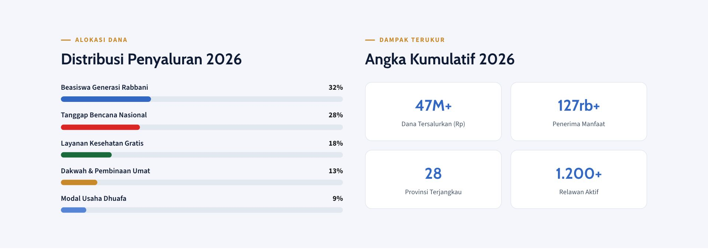

- **Field:** Kunci metrik/`metric_key` — kode unik, misal `total_funds_distributed_m` (wajib, otomatis lowercase & pakai underscore), Label tampilan — misal "Dana Tersalurkan (Rp)" (wajib), Nilai angka (wajib), Suffix — misal "M+", "rb+" (opsional), Urutan tampil, Status Aktif.
- **Aksi:** Tambah, Edit, Hapus.
- **Catatan:** **Hati-hati mengetik `metric_key`** — sistem tidak memvalidasi duplikat. Kalau kunci salah ketik/dobel, angka di web publik bisa tidak muncul atau salah tampil. Tidak ada upload gambar di sini, murni data angka.

## 7. Tim & Pengurus — `/web-team`

**Mengatur:** Blok **"Tim Kepemimpinan"** di halaman **Tentang Kami**.

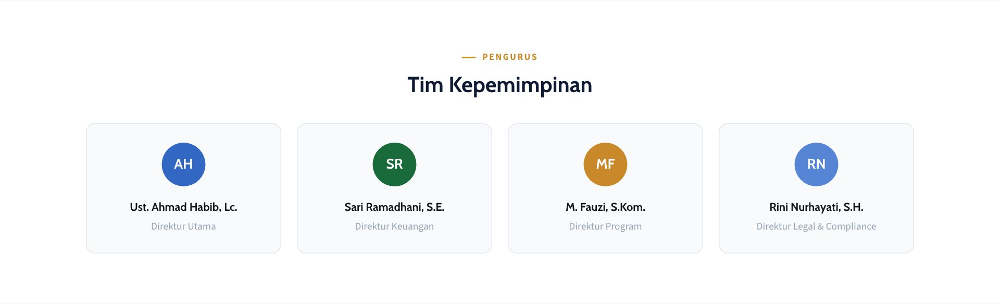

- **Field:** Nama lengkap (wajib), Jabatan (wajib), Departemen (opsional), Bio singkat (opsional), Foto (opsional, kalau kosong pakai inisial nama), Urutan tampil, Status Aktif.
- **Aksi:** Tambah Pengurus, Edit, Hapus.
- **Catatan:** Warna lingkaran inisial (kalau tanpa foto) memakai warna biru default — tidak ada pilihan warna di form.

## 8. Legalitas — `/web-legality`

**Mengatur:** Blok **"Dokumen Resmi"** di halaman **Tentang Kami** (SK Kemenag, NPWP, Akta Notaris, Reg. BAZNAS, dll).

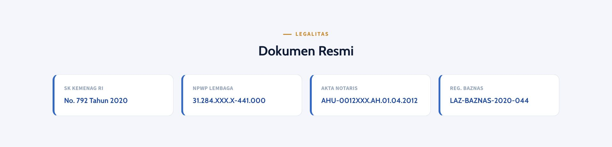

- **Field:** Judul dokumen (wajib), Nomor dokumen (opsional), Diterbitkan oleh (opsional), Tanggal terbit (opsional), File pendukung (opsional — PDF/gambar), Urutan tampil, Status Aktif.
- **Aksi:** Tambah Dokumen, Edit, Hapus.
- **Catatan:** Beda dengan Laporan Keuangan, file di sini **opsional** — boleh disimpan tanpa lampiran, hanya tampil judul & nomornya saja.

## 9. Rekening Resmi — `/web-banks`

**Mengatur:** Blok **"Rekening Donasi Terpercaya"** di halaman **Layanan ZISWAF** — rekening bank untuk transfer manual.

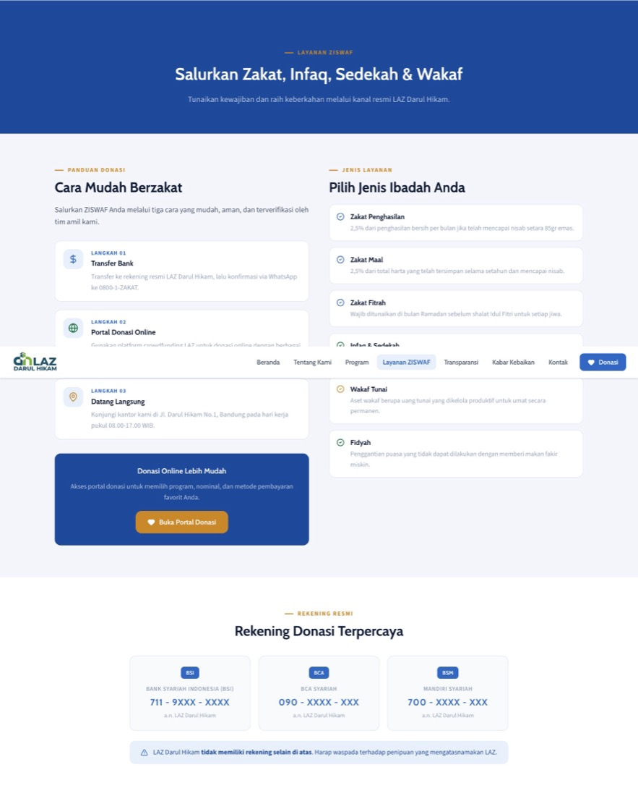

- **Field:** Nama bank (wajib), Nomor rekening (wajib), Nama pemilik rekening (wajib, default "LAZ Darul Hikam"), Kode bank (opsional), Logo bank (opsional), Urutan tampil, Status Aktif.
- **Aksi:** Tambah Rekening, Edit, Hapus.
- **Catatan:** Sistem tidak mengecek nomor rekening ganda — pastikan tidak input dua kali secara tidak sengaja. Ini murni untuk **transfer manual**; metode pembayaran digital (QRIS/VA/e-wallet) diatur di menu **Payment Channels** (modul Crowdfunding).

## 10. FAQ — `/web-faqs`

**Mengatur:** Bagian **"Pertanyaan Umum"** di halaman **Kontak**.

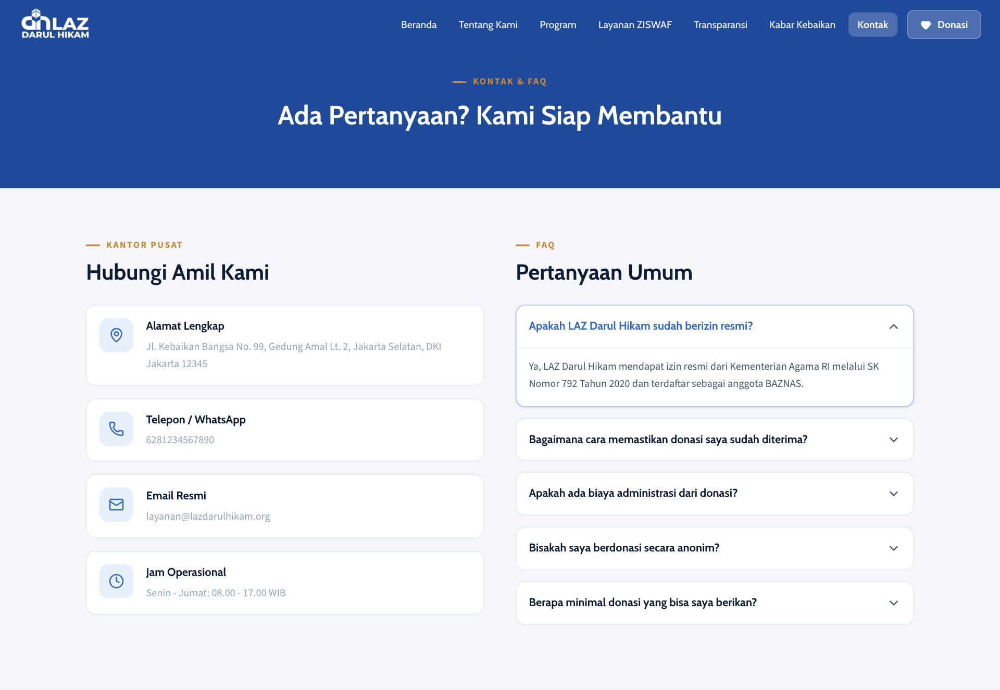

- **Field:** Pertanyaan (wajib), Jawaban (wajib), Kategori — pilihan tetap: Umum, Donasi & Transfer, Zakat & Nisab, Program & Penyaluran, Kemitraan, Teknis & Akun, Urutan tampil, Status Aktif.
- **Aksi:** Tambah FAQ, Edit, Hapus.
- **Catatan:** Kategori adalah daftar tetap (tidak bisa bikin kategori baru dari admin panel) — pilih kategori yang paling sesuai.

---

# Bagian 2 — Modul Crowdfunding

Modul ini mengatur **kampanye donasi, uang masuk, donatur, dan afiliasi**. Sesuai aturan proyek, semua query ke tabel `transactions`/`invoices` di backend memakai **raw SQL** dan selalu menyertakan `created_at` karena tabel-tabel ini di-partition.

## 1. Dashboard — `/dashboard`

**Mengatur:** Halaman ini **tidak mengubah apa pun di web publik** — murni ringkasan kinerja untuk admin: total donasi, total donatur, jumlah kampanye aktif, transaksi berhasil, grafik tren donasi 7 hari, dan progres pencapaian target NGO tahunan. Read-only, tidak ada tombol simpan.

## 2. Kampanye — `/campaigns`

**Mengatur:** Semua kartu program di halaman **Program** dan carousel di beranda.

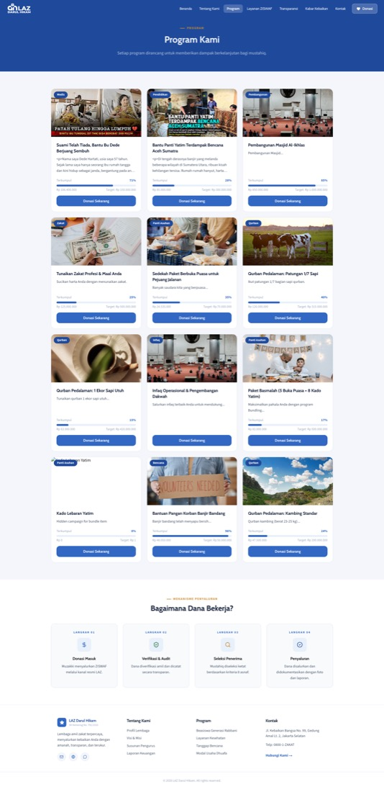

- **Field utama:** Judul, Slug URL, Kategori, Deskripsi lengkap (rich text), Target dana (opsional bila "tanpa target"), Tanggal berakhir (opsional bila "tanpa batas waktu"), Nominal minimum donasi, Nominal saran cepat (mis. Rp10rb/25rb/50rb), Foto sampul, Urutan tampil, Status (Aktif/Nonaktif/Draft).
- **Flag khusus:** Darurat, Tampilkan di carousel beranda, Kampanye Zakat, Kampanye Qurban, Terverifikasi, Tanpa target, Tanpa batas waktu, Nominal tetap, Kampanye bundel, serta persentase komisi afiliasi default.
- **Di halaman edit juga bisa atur:** Varian/Paket harga (misal patungan qurban per 1/7 ekor vs 1 ekor penuh), Bundling ke kampanye lain, dan QRIS statis (kode QR khusus kampanye tsb).
- **Halaman detail kampanye** menampilkan progres dana, jumlah donatur, grafik 7 hari, serta 2 tab: **Riwayat Transaksi** dan **Kabar Penyaluran** (bisa tambah update langsung dari sini).
- **Aksi:** Tambah Kampanye, Lihat, Edit, **Duplikat** (menyalin sebagai kampanye baru), Hapus.
- **Catatan:** Duplikat hanya menyalin data dasar — varian, bundling, dan QRIS tidak ikut tersalin.

## 3. Kabar Penyaluran — `/campaign-updates`

**Mengatur:** Tab **"Info Terbaru"** di halaman detail kampanye publik (laporan progres penyaluran dana).

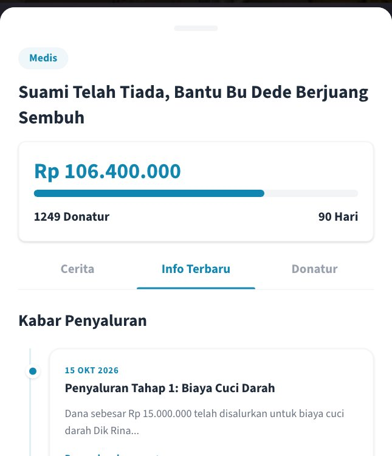

- **Field:** Kampanye terkait (wajib, pilih dari dropdown), Judul, Ringkasan, Isi lengkap (rich text), Foto dokumentasi.
- **Aksi:** Tambah, Edit, Hapus. Tidak ada status draft/publish — begitu disimpan langsung tampil di web publik.
- **Catatan:** CRUD yang sama juga tersedia langsung di dalam halaman detail kampanye (tab Kabar Penyaluran), untuk kemudahan saat sedang mengelola satu kampanye tertentu.

## 4. Kategori — `/categories`

**Mengatur:** Label kategori (badge) yang tampil di kartu kampanye halaman **Program** — misalnya "Medis", "Pendidikan", "Qurban".

- **Field:** Nama, Warna tema (pilih dari palet tetap: rose, blue, orange, teal, emerald, amber, indigo, slate), Status Aktif.
- **Aksi:** Tambah, Edit, Hapus, Lihat detail (jumlah kampanye yang memakai kategori ini).
- **Catatan:** Kategori yang masih dipakai kampanye kemungkinan tidak bisa dihapus (akan muncul pesan error).

## 5. Transaksi — `/transactions`

**Mengatur:** **Tidak langsung terlihat di web publik** sebagai halaman tersendiri, tapi ini adalah pembukuan semua donasi yang masuk — sumber angka "Terkumpul" dan "Donatur" di setiap kampanye, serta tab **Donatur** di halaman detail kampanye.

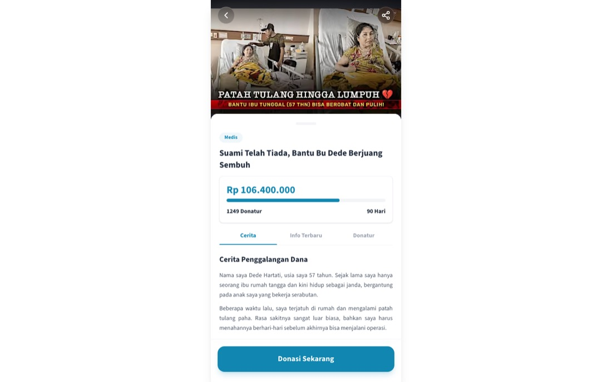

- **Dua tab:** **Invoice** (satu baris per transaksi pembayaran, bisa berisi beberapa item kampanye) dan **Donasi** (satu baris per donasi ke satu kampanye, termasuk atribusi afiliasi).
- **Filter:** pencarian, status, afiliasi, metode pembayaran, rentang tanggal, rentang nominal, kampanye.
- **Aksi:** Tandai Lunas, Lihat bukti transfer, Hapus, Lihat Detail (rincian invoice, nama qurban jika ada, log gateway pembayaran, log notifikasi, log konversi iklan), **Export ke Excel**.
- **Catatan penting:** karena tabel `transactions`/`invoices` di-*partition* per `created_at`, update status maupun hapus **selalu menyertakan kombinasi `id` + `created_at`** — ini ditangani otomatis oleh sistem, admin cukup pakai tombol yang tersedia.

## 6. Donatur — `/donors`

**Mengatur:** Database donatur (CRM) — data ini otomatis terkumpul dari riwayat transaksi, ditampilkan juga sebagai jumlah donatur di setiap kampanye publik.

- **Field:** Nama, Email, Telepon, Total donasi & jumlah donasi (otomatis dihitung sistem, tidak bisa diedit manual).
- **Aksi:** Tambah donatur manual, Edit (nama/email/telepon saja), Hapus, Lihat profil lengkap (riwayat semua invoice donatur tsb), Export ke Excel.

## 7. Afiliasi — `/affiliates`

**Mengatur:** Program referral — mitra/individu yang mempromosikan kampanye lewat kode/link unik dan mendapat komisi. Tidak tampil sebagai halaman khusus di situs publik, tapi menentukan siapa yang dapat komisi dari donasi yang masuk lewat link mereka.

- **Field list:** Kode afiliasi (unik), Nama, Email, Telepon, Status Aktif/Nonaktif, jumlah donatur terkonversi, total dana terkumpul, saldo komisi berjalan (otomatis).
- **Halaman detail punya 3 tab:**
  - **Komisi Kampanye** — atur komisi per kampanye: persentase (%) atau nominal tetap (Rp), menggantikan komisi default kampanye.
  - **Data Transaksi** — daftar transaksi yang terhubung ke afiliasi ini (read-only).
  - **Riwayat Withdrawal** — permintaan pencairan komisi afiliasi ini (bisa diproses langsung dari sini).
- **Aksi:** Tambah, Edit, Hapus, Lihat detail.

## 8. Penarikan — `/withdrawals`

**Mengatur:** Persetujuan pencairan saldo komisi afiliasi. Tidak terlihat di web publik.

- **Field:** Nama/kode afiliasi, Nominal, Info rekening tujuan, Status (Pending/Berhasil/Batal), tanggal request & diproses.
- **Aksi:** Lihat detail, **Proses** (menyetujui — saldo afiliasi otomatis berkurang), **Tolak/Batalkan**, Hapus.
- **Catatan:** Hanya permintaan berstatus *Pending* yang punya tombol Proses/Tolak — ini satu-satunya "gerbang persetujuan" sebelum komisi afiliasi benar-benar cair.

## 9. Notifikasi — `/notifications`

**Mengatur:** Template pesan otomatis (WhatsApp/Email/SMS) yang dikirim ke donatur saat ada kejadian tertentu (misal invoice dibuat, pembayaran sukses). Efeknya terlihat di pesan yang diterima donatur, bukan di halaman web.

- **Field:** Event pemicu (mis. `INVOICE_CREATED`, `PAYMENT_SUCCESS`), Kanal (WhatsApp/Email/SMS), Isi pesan (mendukung variabel `{nama}`, `{nominal}`, `{invoice_code}`, `{metode}`, `{va_number}`), Status Aktif.
- **Aksi:** Tambah, Edit, Hapus, Lihat detail.
- **Catatan:** Tidak ada fitur "kirim tes" — perubahan template baru terlihat efeknya saat ada transaksi nyata yang memicu event tersebut.

## 10. Admin — `/admins`

**Mengatur:** Akun pengguna admin panel ini sendiri (bukan konten publik).

- **Field:** Nama, Email (untuk login), Role (ADMIN / FINANCE / SUPERADMIN), Status Aktif/Nonaktif.
- **Aksi:** Tambah, Edit, Hapus, Lihat detail.
- **Catatan:** Password tidak diisi manual — sistem mengirim instruksi setup password ke email admin baru. Menu yang sama persis juga bisa diakses lewat **Pengaturan → tab Manajemen User**.

## 11. Payment Channels — `/payment-channels`

**Mengatur:** Daftar metode pembayaran yang muncul saat donatur checkout di web publik (langkah "Pilih Metode Pembayaran").

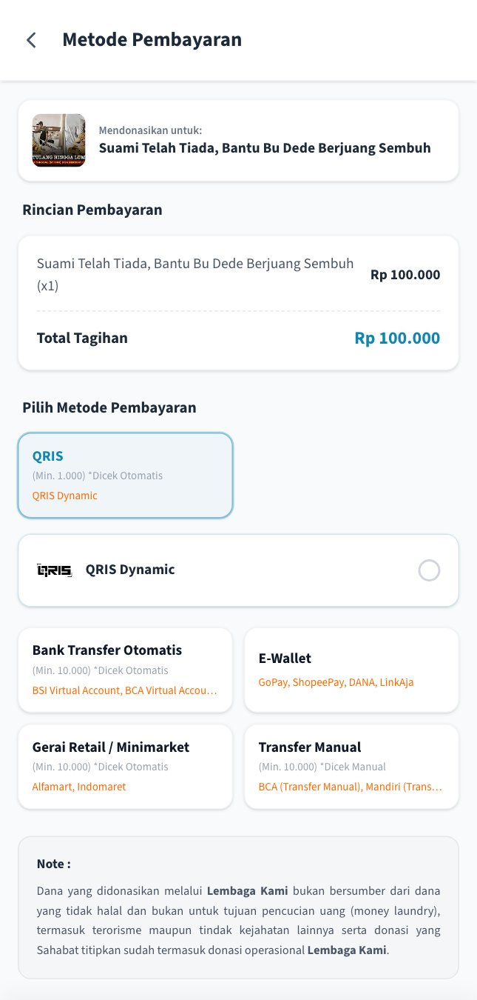

- **Field:** Kode, Nama, Logo, Provider/vendor (moota, faspay, midtrans, xendit, manual), Tipe (bank_transfer, e_wallet, va, qris, manual_transfer, retail_outlet, qr_code), Status Aktif, apakah checkout redirect ke halaman eksternal.
- **Aksi:** Tambah, Edit, **Duplikat**, Hapus, urutan tampil bisa diatur **drag-and-drop** (khusus menu ini, beda dari menu-menu website yang pakai input angka).
- **Sub-halaman "Instructions":** mengatur instruksi langkah-demi-langkah pembayaran per channel (misal cara bayar via BCA mobile banking) — juga drag-and-drop.

## 12. Log Sistem — `/logs`

**Mengatur:** Tidak ada efek ke web publik — ini panel observabilitas untuk debugging: **Payment Logs** (callback dari payment gateway), **Notification Logs** (pengiriman WhatsApp/Email), **Ads Conversion Logs** (push konversi ke Meta/TikTok/Google Ads). Read-only, bisa lihat detail payload JSON mentah per baris.

## 13. Pengaturan — `/settings`

**Mengatur:** Identitas & branding situs secara keseluruhan — nama NGO, logo, warna tema, kontak, dan pixel tracking. Ini adalah sumber data untuk header/footer di **semua halaman publik**.

- **Tab Konfigurasi Umum:** Nama NGO, Logo, Favicon, Video profil, Warna utama (mempengaruhi warna tema situs), Nomor WhatsApp, Deskripsi singkat, Alamat, Info legal, link Instagram/Facebook, serta ID/token tracking Meta Pixel, Google Ads, dan TikTok Pixel.
- **Tab Manajemen User:** sama persis dengan menu **Admin** di atas.
- **Tab Pixel Events:** memetakan aksi di aplikasi (mis. "page_view", "purchase_success") ke nama event spesifik Meta/TikTok/Google Ads — supaya tim marketing bisa mengubah pemetaan event tanpa perlu deploy ulang kode.
- **Catatan:** Setelah simpan, halaman otomatis reload supaya branding baru langsung terlihat.

---

## Ringkasan pola umum

- **"Urutan Tampil"** di sebagian besar menu website (testimoni, mitra, metrics, tim, legalitas, rekening, FAQ) diisi **manual pakai angka** — bukan drag-and-drop. Hanya **Kampanye** dan **Payment Channels** yang mendukung drag-and-drop.
- **Hapus data:** hanya menu **Artikel** yang soft-delete (data diarsipkan). Menu lainnya menghapus permanen setelah konfirmasi.
- **Status Aktif/Nonaktif** di menu-menu konten = sekadar tombol tampil/sembunyi di web publik, bukan alur approval — data tetap ada & bisa diedit kapan saja di admin panel.
